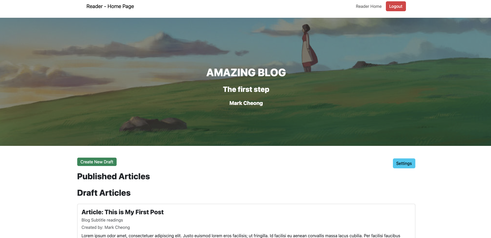

# Blog Page

## About
This is a simple blog post project to learn more about using SQL, Javascript and EJS.

## AUTHOR USERNAME AND PASSWORD
Username: author
Password: password

## Getting started
Get the project running with the following steps
1. Create a personal Fork of this repository
2. Open VSCode
3. Open the terminal and navigate to the source code folder
4. Run `npm install`, `npm run build-db`, and then `npm run start`sequentially.